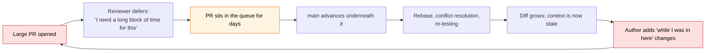
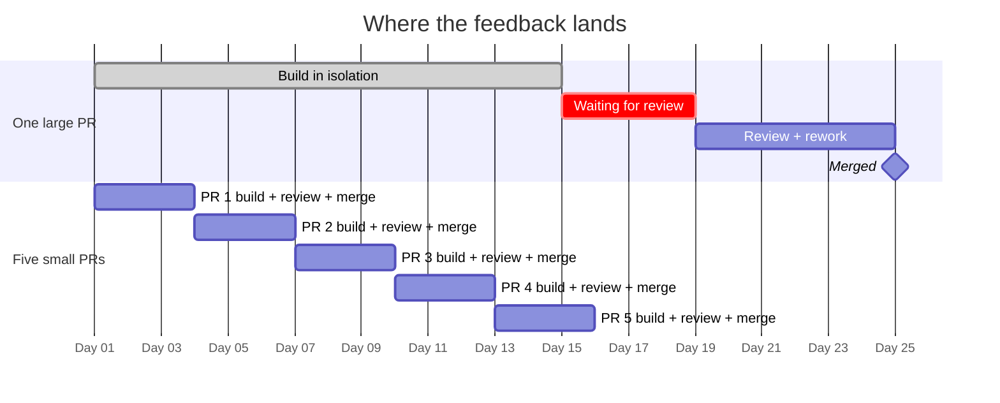
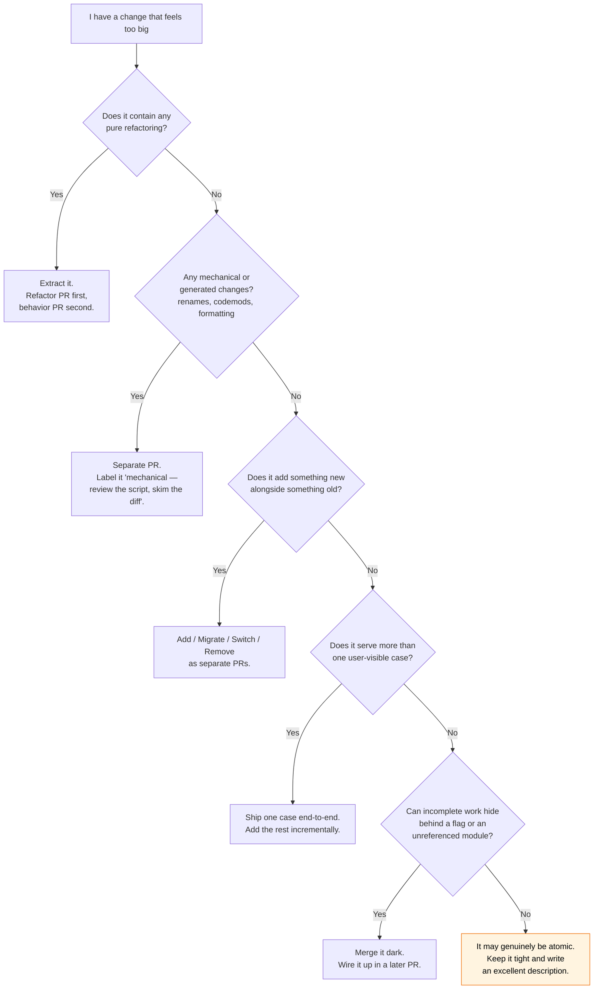
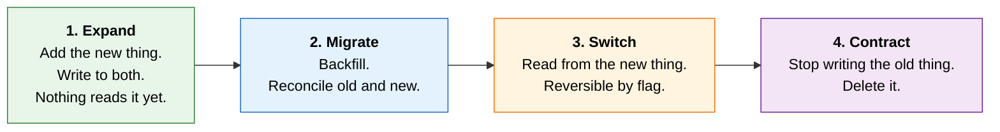
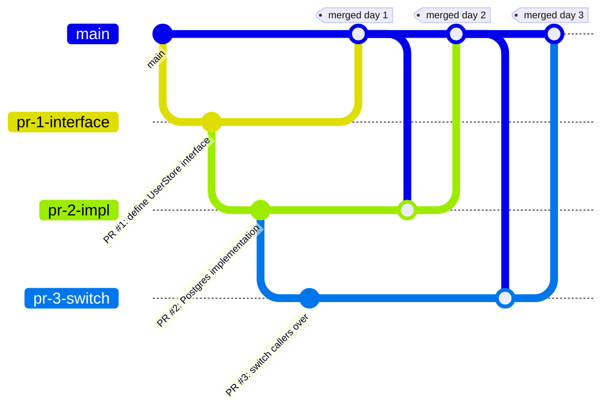

# Ship Smaller: The Case for Small Pull Requests

> A large pull request is not a large contribution. It is a large *request* — for someone else's attention, judgment, and trust, all at once.

Most teams agree in the abstract that small pull requests are better. Far fewer teams actually produce them, because the forces pushing toward large PRs are immediate and concrete ("I'm already deep in this file") while the costs are diffuse and land on other people ("someone will review it eventually").

This document makes the costs concrete, explains the philosophy underneath the practice, and gives you the specific techniques for splitting work that *feels* atomic into changes that are genuinely reviewable.

---

## Table of contents

- [The core idea](#the-core-idea)
- [Why review quality collapses with size](#why-review-quality-collapses-with-size)
- [The latency death spiral](#the-latency-death-spiral)
- [Feedback timing is the whole game](#feedback-timing-is-the-whole-game)
- [Risk, reversibility, and blast radius](#risk-reversibility-and-blast-radius)
- [The social dynamics nobody talks about](#the-social-dynamics-nobody-talks-about)
- [How to actually split a change](#how-to-actually-split-a-change)
- [How small is small enough?](#how-small-is-small-enough)
- [When a big PR is fine](#when-a-big-pr-is-fine)
- [Objections worth taking seriously](#objections-worth-taking-seriously)
- [Making it stick](#making-it-stick)
- [Checklist](#checklist)
- [Further reading](#further-reading)

---

## The core idea

Software is not built in increments of code. It is built in increments of *understanding*. A pull request is the unit at which understanding gets transferred from one head to another and validated.

That reframing does most of the work here. If a PR is a unit of transferred understanding, then:

- **Its ideal size is set by human working memory, not by how much you happened to write.** A reviewer can hold roughly one idea in their head at full fidelity. Give them four, and they will review one carefully and skim three.
- **"I can't split this" is a statement about the design, not the task.** Changes that resist decomposition are usually changes where responsibilities are tangled. The difficulty of splitting is diagnostic information about your architecture, and it's worth listening to.
- **Reviewability is a property you design for**, the same way you design for testability. Nobody says "this code is impossible to unit test, that's just how the feature is." Same energy applies here.

The practice of small PRs is really the practice of decomposing problems, with code review as the forcing function that keeps you honest.

---

## Why review quality collapses with size

Reviewer attention is close to a fixed budget. It does not scale with the diff.

What that means in practice is that *defects found per line* drops sharply as PR size grows — not because reviewers get lazy, but because the review shifts modes. Below a certain size, a reviewer simulates the code in their head. Above it, they pattern-match. Pattern-matching catches style issues and obvious nulls. It does not catch "this cache invalidation is subtly wrong under concurrent writes."

The industry's most frequently cited code review research (the Cisco/SmartBear studies from the mid-2000s, and Google's published engineering practices since) converges on a similar shape: effectiveness holds up in the low hundreds of changed lines and degrades meaningfully past that, and reviewer attention falls off after roughly an hour of continuous review. Treat those as directional rather than gospel — the mechanism matters more than the exact number.

There's a second-order effect that's worse than the first. Large PRs get *fewer* comments, not more, and teams read that as a good sign:

| PR size | What the reviewer does | Typical outcome |
|---|---|---|
| ~50 lines | Reads every line, mentally executes it | Substantive comments on logic |
| ~200 lines | Reads carefully, spot-checks the edges | Good coverage, some blind spots |
| ~700 lines | Reads the interesting parts, skims the rest | Comments on structure, misses details |
| ~2,000 lines | Checks the tests exist and the CI is green | "LGTM" |

A silent large PR is not a clean large PR. It's an unreviewed one.

---

## The latency death spiral

Size and latency reinforce each other, and this is where most of the real cost lives.



Each lap around this loop makes the next lap worse. The PR that has been open for three weeks is open for three weeks *because* it is large, and is large *because* it has been open for three weeks.

There's a useful piece of flow theory here. Little's Law says cycle time is proportional to work-in-progress divided by throughput. Batch size is the single most direct lever you have on WIP. Halving your average PR size roughly halves the time any given change spends in flight — before accounting for the compounding effects above.

Merge conflict probability is worse than linear. It scales with (surface area × time open), and both of those grow together in a large PR. Two 100-line PRs merged a day apart almost never conflict. One 1,000-line PR open for two weeks conflicts with nearly everything.

---

## Feedback timing is the whole game

The strongest argument for small PRs has nothing to do with review throughput. It's that **the cost of being wrong grows with how long you've been wrong.**



In the top track, the first external signal about your approach arrives on day 18. If the architectural direction is wrong, eighteen days of work is wrong with it — and by then the sunk cost is large enough that everyone involved will be tempted to patch around the problem rather than back it out.

In the bottom track, that same signal arrives on day 3, when the cost of changing direction is a conversation instead of a rewrite. Note the other axis of the comparison, too: the incremental track is fully merged on day 15, while the single large PR is still in rework on day 24. Splitting did not slow the work down — the review queue and the rebases did.

This is why small PRs are best understood as **hypothesis tests**. Each one asks a question — "is this the right abstraction?", "does this interface make sense to someone who didn't write it?", "does this actually behave correctly in production?" — and gets an answer while the answer is still cheap to act on.

A related benefit: momentum is real. Five merged PRs in a week is five moments of closure, five things that are definitively *done* and can't regress silently. One PR open for three weeks is three weeks of ambient anxiety and a growing sense that the change is too big to finish.

---

## Risk, reversibility, and blast radius

Small PRs make your history a usable debugging tool.

**Bisection precision.** `git bisect` narrows a regression down to a single commit. Whether that's useful depends entirely on what a single commit contains. Landing at "the 1,400-line PR that touched auth, caching, and the API layer" tells you almost nothing. Landing at "the 40-line PR that changed the cache key derivation" tells you everything.

**Revert cost.** Reverting a small PR is a one-line decision. Reverting a large one means also reverting the four unrelated improvements that rode along with it, and possibly the three PRs that were built on top of it. Teams that can't cheaply revert end up rolling *forward* under pressure at 2am, which is how one incident becomes two.

**Deploy risk.** Risk correlates with the number of independent changes in a release, not the number of lines. Ten small changes shipped over a week each get their own window to reveal themselves in production. The same ten shipped together produce a single ambiguous signal — something is off, and you now get to guess which of ten things it was.

---

## The social dynamics nobody talks about

A large PR is emotionally expensive to reject, and reviewers know it.

When someone opens a 2,000-line PR representing three weeks of work, a reviewer who thinks the approach is wrong is not making a technical comment anymore. They're asking a colleague to throw away three weeks. That's a hard thing to do, and the entirely human response is to soften: to suggest a tweak instead of naming the structural problem, or to approve with a vague note and let it be someone else's problem later.

Small PRs make disagreement cheap. Saying "I don't think this is the right abstraction" about 80 lines of work is a normal Tuesday. The same sentence about 2,000 lines is a confrontation.

The flip side matters too: small PRs protect the *author*. You find out on day two that the team wants a different approach, rather than on day eighteen — after you've told your manager it's nearly done.

---

## How to actually split a change

This is where most people get stuck, so here are the specific patterns.

### The single highest-leverage rule: never mix refactoring with behavior change

If one PR both moves code around and changes what it does, the reviewer cannot tell which diff lines are mechanical and which are semantic. They have to verify all of it by hand, which means in practice they'll verify none of it.

Split it in two, and each half becomes nearly trivial to review:

- **PR 1 (refactor):** no behavior change. Tests are untouched and still pass. The reviewer's only question is "is this really behavior-preserving?"
- **PR 2 (behavior):** small, focused, obvious. The reviewer's only question is "is this new behavior correct?"

This is Kent Beck's *"make the change easy, then make the easy change."* The preparatory refactoring is a first-class deliverable, not scaffolding.

### Slice vertically, not horizontally

The instinct is to split by layer: "database PR, then service PR, then API PR, then UI PR." This is the worst possible split. Nothing is testable or shippable until the last one lands, so you've kept all the risk of a big-bang change while adding review overhead.

Split by capability instead. One narrow feature that goes all the way through the stack — one endpoint, one field, one case — is independently deployable and independently valuable.

### Use a decision procedure



In practice, question 5 has a "yes" answer far more often than people expect. Code that nothing calls yet is safe to merge. Merging it early means the *review* is done, and the wiring-up PR later is three lines.

### Expand / Migrate / Contract

For anything with a compatibility constraint — schema changes, API versions, shared library interfaces — the sequential pattern is:



Four small PRs, each independently reviewable, each independently revertable, and the system is in a valid state after every one. Compare to a single PR that drops a column and rewrites every caller simultaneously.

### Stack your PRs

When work is genuinely sequential, don't wait — stack it. Each PR targets the previous one as its base, so reviewers see a clean incremental diff rather than a cumulative one.



Link the stack in each description ("Part 2 of 3 — builds on #412, followed by #414") so reviewers can see the arc. Tooling like `git town`, Graphite, or Gerrit's native chains makes the rebasing painless, but plain branches work fine for stacks of two or three.

### Feature flags and dark launching

A flag decouples *merging* from *releasing*. Once you internalize that, "this isn't finished yet" stops being a reason to keep a branch open. Merge the incomplete work behind a flag that's off, keep `main` green, and flip the flag as its own tiny, instantly revertable change.

Budget for flag removal — a codebase full of dead flags has traded one problem for another. Make the cleanup PR part of the plan, not an aspiration.

---

## How small is small enough?

Line count is a proxy, and a mediocre one. The real question is **how many independent decisions does this PR ask the reviewer to evaluate?** The target is one, maybe two.

That said, proxies are useful because they're measurable:

- **Under ~200 changed lines** is comfortable. A reviewer can do it well in one sitting without scheduling it.
- **200–400** is the upper end of "careful review is realistic."
- **Over ~400** should come with a justification in the description.
- **Over ~1,000** should be rare enough that it's worth asking why.

Two better heuristics than line count:

1. **The one-sentence test.** If you can't describe the PR in a single sentence without using "and," it's probably two PRs.
2. **The interruption test.** If a reviewer would need to block out dedicated time rather than picking it up between meetings, it's too big.

---

## When a big PR is fine

Dogma is its own failure mode. Legitimately large PRs include:

- **Generated code, lockfiles, vendored dependencies.** Review the generator or the version bump, not the output.
- **Mechanical codemods.** Review the script and a sample. Say so explicitly in the description.
- **Pure file moves or renames.** Keep them *pure* — a rename PR that also fixes a bug is the worst of both worlds, because the bug fix is invisible.
- **Brand-new isolated modules that nothing imports yet.** Low risk by construction.

The common thread: these are large in *lines* but small in *decisions*. That's the metric that actually matters. Label them clearly so reviewers know which mode to use, and consider separating the mechanical parts into their own commits within the PR so reviewers can step through them.

---

## Objections worth taking seriously

**"Splitting has real overhead — more PRs, more CI runs, more context switches."**
True, and it's the honest cost. But most of that overhead is fixed cost per PR, which means it's a *tooling* problem, and tooling problems are tractable. If opening a PR is expensive on your team, fix that; it's taxing every good practice you have, not just this one.

**"Reviewers lose the big picture across many small PRs."**
A valid risk, and the fix isn't bigger PRs — it's better context. Write a short design doc or tracking issue, link it from every PR in the series, and number them ("2 of 5"). Reviewers get the architecture once, in the format best suited to discussing architecture, and then review implementations against it. Trying to communicate design *through a diff* was never going to work well anyway.

**"The intermediate states are incomplete."**
Incomplete is not the same as broken. Unreferenced code, code behind an off flag, and code with only one of three cases implemented are all perfectly valid states for `main`. The requirement is that `main` always works — not that it's always finished.

**"Our CI takes 45 minutes, so batching is rational."**
Correct, and that's the actual bug. Slow CI is a tax that compounds into everything: bigger batches, slower feedback, more conflicts, more risk. Small PRs will feel bad until you fix it. Fix it.

**"Reviews take three days on my team, so I might as well make them count."**
Also correct, and also the actual bug. This one is important: **small PRs require fast reviews.** It's a two-sided contract. If review latency is high, batching work is a rational response, and no amount of exhortation about PR size will change that. Fix the review side first — team norms like "review requests are handled within one business day" or "review before you start new work" — and PR sizes tend to come down on their own.

---

## Making it stick

**Write descriptions that do the reviewer's setup work for them.** A small PR with a good description gets reviewed in ten minutes. Something like:

```markdown
## What
One-sentence summary.

## Why
The problem or the link to the issue.

## Notes for the reviewer
- This is part 2 of 3 — builds on #412.
- The change in `parser.go` is a pure extraction; behavior is unchanged.
- `schema.sql` is generated — review the migration, skim the output.
```

**Measure the flow, not the people.** Useful signals: time to first review, PR cycle time, size distribution (p50 and p90), revert rate. Watch them as a team health indicator, never as individual performance metrics — the moment PR size becomes a personal target, people will split PRs arbitrarily and you'll have made things worse.

**Make the reviewer role explicit.** Fast, frequent, small reviews are a habit that has to be built deliberately. Reviewing is not the thing you do after your real work; on a team that ships incrementally, it *is* a substantial part of the real work.

---

## Checklist

Before you open a PR:

- [ ] Can I describe this in one sentence without "and"?
- [ ] Is there refactoring mixed in with behavior change?
- [ ] Are there mechanical changes that should be separated?
- [ ] Could part of this merge safely today, behind a flag or unreferenced?
- [ ] Does the description tell the reviewer where to focus and where to skim?
- [ ] If this is part of a series, is the series linked and numbered?

And the one that matters most, because everything above is downstream of it:

- [ ] **If the direction turns out to be wrong, how much work do I lose?**

Keep that number small, and most of the rest takes care of itself.

---

## Further reading

- [Google Engineering Practices — *Small CLs*](https://google.github.io/eng-practices/review/developer/small-cls.html) — the canonical short version of this argument, including the exceptions Google explicitly accepts.
- [Martin Fowler — *ParallelChange*](https://martinfowler.com/bliki/ParallelChange.html) — expand / migrate / contract in its original framing.
- [Martin Fowler — *FeatureToggle*](https://martinfowler.com/bliki/FeatureToggle.html) — a taxonomy of flags, and the case for budgeting their removal up front.
- **Cisco / SmartBear code review study (2006)**, reported in *Best Kept Secrets of Peer Code Review* — the source behind the "~200–400 lines, ~60 minutes" figures cited above. Directional, not gospel.
- **Kent Beck** — *"make the change easy (warning: this may be hard), then make the easy change."* The origin of the refactor-first split.
